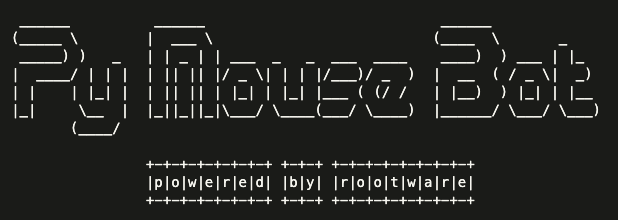

# PyMouseBot

<!-- ```console
 ______          ______                            ______             
(_____ \        |  ___ \                          (____  \       _    
 _____) )   _   | | _ | | ___  _   _  ___  ____    ____)  ) ___ | |_  
|  ____/ | | |  | || || |/ _ \| | | |/___)/ _  )  |  __  ( / _ \|  _) 
| |    | |_| |  | || || | |_| | |_| |___ ( (/ /   | |__)  ) |_| | |__ 
|_|     \__  |  |_||_||_|\___/ \____(___/ \____)  |______/ \___/ \___)
       (____/                                                         
                                          
                +-+-+-+-+-+-+-+ +-+-+ +-+-+-+-+-+-+-+-+
                |p|o|w|e|r|e|d| |b|y| |r|o|o|t|w|a|r|e|
                +-+-+-+-+-+-+-+ +-+-+ +-+-+-+-+-+-+-+-+
``` -->
<p align="center">
  
</p>

> If you're from GT and annoyed with SGVPN idle timeouts while working on development laptop, You might find this useful.
A python script to move your mouse every few seconds to appear active on Skype, Teams or Zoom as you go AFK. 🐭 🐭
> Standard Disclaimer: Author assumes no liability for any damage done on your machines.

## Core Features

- 💻 Cross platform. Both Windows and MacOS. Automagically detects what OS you're running on!
- 🕒 Just run the program together with time you want to stop at in HH:MM:SS 24 hr format!
- 🪶 Ultra light! No compiled binaries. Just a cli app you can use via python.

## How to use
