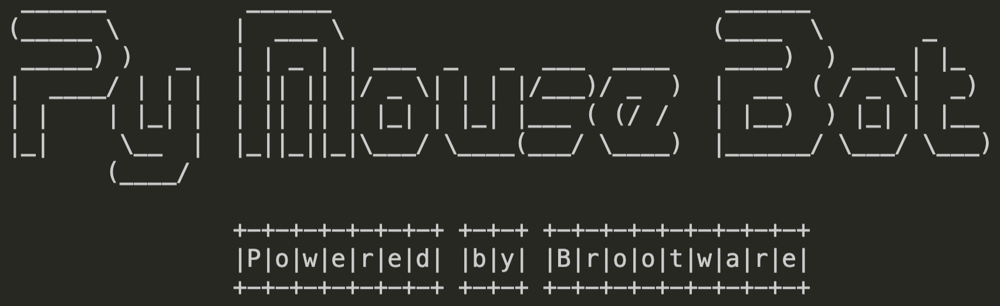

# PyMouseBot

<!-- ```console
 ______          ______                            ______             
(_____ \        |  ___ \                          (____  \       _    
 _____) )   _   | | _ | | ___  _   _  ___  ____    ____)  ) ___ | |_  
|  ____/ | | |  | || || |/ _ \| | | |/___)/ _  )  |  __  ( / _ \|  _) 
| |    | |_| |  | || || | |_| | |_| |___ ( (/ /   | |__)  ) |_| | |__ 
|_|     \__  |  |_||_||_|\___/ \____(___/ \____)  |______/ \___/ \___)
       (____/                                                         
                                          
                +-+-+-+-+-+-+-+ +-+-+ +-+-+-+-+-+-+-+-+-+
                |P|o|w|e|r|e|d| |b|y| |B|r|o|o|t|w|a|r|e|
                +-+-+-+-+-+-+-+ +-+-+ +-+-+-+-+-+-+-+-+-+
``` -->
<p align="center">
  
</p>

> If you're from GT and annoyed with SGVPN idle timeouts while working on development laptop, You might find this useful.

A python cli bot to move your mouse every few seconds to appear active on Skype, Teams or Zoom as you go AFK. 🐭 🤖

## Core Features

- 💻  Cross platform. Both Windows and MacOS. Automagically detects what OS you're running on!
- 🕒  Just run the program together with time you want the bot to stop at in `HH:MM:SS` 24 hr format!
- 🪶  Ultra light! No compiled binaries. Just a cli app you can use via python.

## Pre-requisites

- [Python3](https://www.python.org/downloads/) installed
- [pip](https://packaging.python.org/en/latest/guides/installing-using-pip-and-virtual-environments/) installed

## How to use

- [x] To add instructions

### On Mac

```bash
git clone https://github.com/brootware/PyMouseBot.git && cd PyMouseBot
```

Activate virtual environment and install requirements.

```bash
alias python=python3
python -m pip install --user virtualenv
python -m venv bottybot
source ./bottybot/bin/activate
pip install -r requirements.txt
```

Run as below

```bash
python mousebot.py 23:00:00
```

OR if you want to run as environment variable, run this below.

```bash
pip install .
pip install -r requirements
pymousebot 23:00:00
```

### On Windows

```powershell
git clone https://github.com/brootware/PyMouseBot.git && cd PyMouseBot
```

Activate virtual environment and install requirements.

```powershell
python -m venv bottybot
bottybot\Scripts\activate
pip install -r requirements.txt
```

Run as below

```powershell
python .\mousebot.py 23:00:00
```

OR if you want to run as environment variable, run this below.

```bash
pip install .
pip install -r requirements
pymousebot 23:00:00
```

## Change time interval of the movement

```bash
python mousebot.py 23:00:00 -i 5
```

OR

```bash
pymousebot 23:00:00 -i 5
```

## Troubleshoot

`import tkinter` might fail on some mac. Be sure to install python-tk via brew.

```bash
brew install python-tk
```
